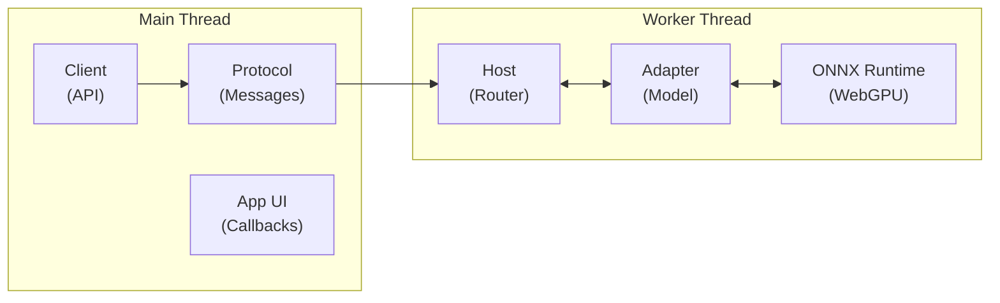

# web-txt2img Architecture

## Overview

`web-txt2img` is a browser-only JavaScript/TypeScript library that generates images from text prompts using AI models running entirely client-side via WebGPU. It's an npm workspaces monorepo:

```
web-txt2img/
├── packages/web-txt2img/     # Core library (published to npm)
│   └── src/
│       ├── adapters/         # Model-specific inference adapters
│       ├── scheduler/        # Diffusion schedulers (9 types, 5 sigma schedules)
│       ├── worker/           # Background thread architecture
│       ├── types.ts          # Public API types
│       ├── registry.ts       # Model registry & factory
│       ├── cache.ts          # Asset caching
│       ├── capabilities.ts   # WebGPU/WASM detection
│       └── index.ts          # Public API entry point
├── examples/vanilla-worker/  # Reference implementation
└── docs/                     # Documentation
```

## Core Architecture

### Worker-Based Design



Key behaviors:
- **Single model** loaded at a time (enforced by worker)
- **Single-flight** execution with queue support
- **Busy policies**: `reject`, `abort_and_queue`, `queue`
- **AbortController**-based cancellation

### Model Adapter System

Each model implements `ModelAdapter` from `types.ts`:

| Adapter | Backend | Runtime | Notes |
|---------|---------|---------|-------|
| `sd-turbo.ts` | WebGPU/WASM | ONNX Runtime Web | 1-step denoising |
| `janus-pro.ts` | WebGPU only | Transformers.js | Multimodal |

Registry (`registry.ts`) manages metadata and factory functions:
```typescript
const REGISTRY: RegistryEntry[] = [
  { id: 'sd-turbo', createAdapter: () => new SDTurboAdapter('/assets/sd-turbo-ort-web') },
  { id: 'sd-turbo-mangled-fp16', createAdapter: () => new SDTurboAdapter('/assets/mangledMerge_onnx_fp16') },
  { id: 'sd-turbo-mangled-int8', createAdapter: () => new SDTurboAdapter('/assets/mangledMerge_onnx_int8') },
  { id: 'janus-pro-1b', createAdapter: () => new JanusProAdapter() },
];
```

### Scheduler System

Located in `src/scheduler/`, supports:
- **9 schedulers**: Euler, DDIM, DPM++ 2M, DPM++ 2M Karras, Euler Ancestral, Heun, DPM-Solver-2, DPM++ SDE, Flow Euler, Flow DPM++ 2M
- **5 sigma schedules**: linear, Karras, exponential, Beta, flow matching
- **5 presets**: fast, balanced, quality, flow_fast, flow_quality
- **Flow matching** for SD3/FLUX-style models

## SD-Turbo Inference Pipeline

The `sd-turbo.ts` adapter implements a 6-stage pipeline:

```
prompt → tokenize → text_encoder → unet → scheduler_step → vae_decoder → PNG
```

### Stage 1: Tokenization
```typescript
// Uses CLIPTokenizer (same as diffusers)
const tokens = await tokenizer(prompt, { padding: 'max_length', max_length: 77 });
```

### Stage 2: Text Encoding
```typescript
// CLIP-ViT → [1, 77, 1024] hidden states
const encOutputs = await text_encoder.run({ input_ids: tokens.input_ids });
```

### Stage 3: Latent Noise Generation
```typescript
// mulberry32 PRNG → Box-Muller → std normal → scale by sigma
function randn_latents(shape, sigma, seed) {
  const data = new Float32Array(size);
  for (let i = 0; i < size; i++) {
    const u = rand(); const v = rand();
    data[i] = Math.sqrt(-2 * Math.log(u)) * Math.cos(2 * Math.PI * v) * sigma;
  }
  return new Tensor(data, shape);
}
```

### Stage 4: UNet Inference
```typescript
// Scale input: latent / sqrt(sigma² + 1)
const scaled = scale_model_inputs(latent, sigma);

// Feed UNet
const unetOutputs = await unet.run({
  sample: scaled,
  timestep: [999],
  encoder_hidden_states: text_embeddings,
});
```

### Stage 5: Scheduler Step
```typescript
// Euler step: x_{t-1} = x_t + epsilon * (sigma_{t-1} - sigma_t)
// CRITICAL: uses ORIGINAL latent, NOT scaled input
function eulerStep(out, sample, sigma, nextSigma) {
  const dt = nextSigma - sigma;
  return sample.data[i] + out.data[i] * dt;
}
```

### Stage 6: VAE Decode → PNG
```typescript
// Scale latents: divide by 0.18215
const vaeInput = scaleLatent(latent, 0.18215);

// Decode: VAE outputs [-1, 1] range
const decoded = await vae_decoder.run({ latent_sample: vaeInput });

// Normalize: v / 2 + 0.5 → [0, 1] → uint8
const pixel = Math.round((v / 2 + 0.5) * 255);
```

## Creating New Assets

### Model Conversion Pipeline

To add a new SD-Turbo variant:

1. **Download model** (safetensors from HuggingFace/Civitai)
2. **Convert to ONNX** using `optimum` or custom script:
   ```bash
   python convert-safetensors-to-onnx.py \
     --input model.safetensors \
     --output model-onnx/
   ```
3. **Verify structure**:
   ```
   model-onnx/
   ├── unet/model.onnx
   ├── text_encoder/model.onnx
   ├── vae_decoder/model.onnx
   └── tokenizer/
       ├── vocab.json
       └── merges.txt
   ```
4. **Test with CLI**:
   ```bash
   python test-model-cli.py \
     --model-path model-onnx \
     --prompt "a photo of an astronaut riding a horse" \
     --output test.png
   ```
5. **Deploy to web**:
   - Copy to `/assets/model-onnx/` in example project
   - Add entry to `registry.ts`
   - Add `ModelId` to `types.ts`

### Key Constants

| Constant | Value | Purpose |
|----------|-------|---------|
| `sigma` | 14.6146 | Starting noise level |
| `vae_scaling_factor` | 0.18215 | Latent→VAE scaling |
| `timestep` | 999 | Max timestep for SD-Turbo |
| `latent_shape` | [1,4,64,64] | 512×512 image latents |

### Precision Options

| Precision | Model Size | Backend | Notes |
|-----------|-----------|---------|-------|
| FP32 | ~2.4 GB | CPU/GPU | Largest, most compatible |
| FP16 | ~1.2 GB | GPU/WebGPU | Default for web |
| INT8 | ~0.6 GB | GPU/WebGPU | Smallest, quantized |

## Mirroring the Pipeline

The `test-model-cli.py` tool validates ONNX models by replicating the web engine pipeline in Python:

```python
# Pipeline stages (must match sd-turbo.ts exactly):
latent = randn_latents([1,4,64,64], sigma=14.6146, seed=42)
scaled = latent / sqrt(sigma**2 + 1)
epsilon = unet.run({"sample": scaled, "timestep": [999], "encoder_hidden_states": text_emb})
denoised = latent + epsilon * (0.0 - sigma)  # sigma_next = 0
vae_input = denoised / 0.18215
image = vae_decoder.run({"latent_sample": vae_input})
png = (image / 2 + 0.5).clip(0,1) * 255
```

See `README-test-model-cli.md` for debugging lessons.

## Future Work: INT8 SD-Turbo Adapter

### Motivation

FP16 models require ~1.2 GB download and WebGPU with float16 shader support. INT8 quantization can halve model size and reduce memory bandwidth, enabling:
- Faster load times on slow connections
- Lower memory footprint for mobile devices
- Compatibility with WebGPU contexts lacking float16 support

### Approach

1. **Quantize ONNX models** using ONNX Runtime quantization tools:
   ```python
   from onnxruntime.quantization import quantize_dynamic, QuantType
   quantize_dynamic(
       model_input="unet/model-fp16.onnx",
       model_output="unet/model-int8.onnx",
       weight_type=QuantType.QUInt8,
   )
   ```

2. **Create INT8 adapter** (`sd-turbo-int8.ts`):
   - Extend `SDTurboAdapter` with INT8-specific loading
   - Add dequantization layers if needed
   - Update `ModelId` type in `types.ts`

3. **Register in `registry.ts`**:
   ```typescript
   {
     id: 'sd-turbo-int8',
     displayName: 'SD-Turbo INT8',
     sizeBytesApprox: 1200 * 1024 * 1024,  // ~50% of FP16
     createAdapter: () => new SDTurboInt8Adapter('/assets/sd-turbo-ort-web-int8'),
   }
   ```

4. **Validate with CLI**:
   ```bash
   python test-model-cli.py \
     --model-path sd-turbo-ort-web-int8 \
     --output test-int8.png
   ```

### Challenges

- **Quality loss**: INT8 quantization may reduce image fidelity
- **Calibration**: Need representative dataset for calibration-based quantization
- **WebGPU support**: Verify INT8 ops are supported in onnxruntime-web WebGPU backend
- **Mixed precision**: Some layers (e.g., final VAE decode) may need FP16/FP32

### Timeline

| Phase | Task | Estimate |
|-------|------|----------|
| 1 | Quantize UNet with ORT tools | 1 day |
| 2 | Test quantized model with CLI | 1 day |
| 3 | Create INT8 adapter | 2 days |
| 4 | Benchmark quality vs FP16 | 1 day |
| 5 | Add to registry & docs | 1 day |
