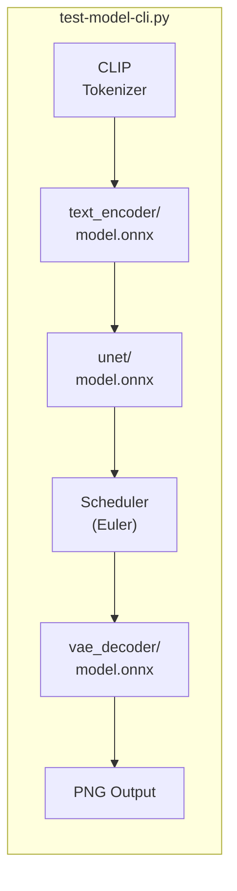

# test-model-cli.py — Architecture & Lessons Learned

A CLI tool that mirrors the [web-txt2img](https://github.com/nicobailon/web-txt2img) ONNX inference pipeline for validating converted Stable Diffusion models.

## Architecture



## Inference Pipeline

### 1. Tokenization
Uses `transformers.CLIPTokenizer` to convert the text prompt into 77 token IDs (padded/truncated).

### 2. Text Encoding
`text_encoder/model.onnx` produces `[1, 77, 1024]` hidden states from CLIP-ViT.

### 3. Latent Noise Generation
```
latent = randn(shape=[1,4,64,64], seed=seed) * sigma
sigma = 14.6146  # SD-Turbo starting noise level
```
Uses mulberry32 PRNG + Box-Muller transform for reproducible noise.

### 4. Model Input Scaling
```
scaled_input = latent / sqrt(sigma² + 1)
```
Prepares latents for UNet inference (matches `EulerDiscreteScheduler.scale_model_input()`).

### 5. UNet Inference
```
feed = {
    "sample": scaled_input,
    "timestep": [999],
    "encoder_hidden_states": text_embeddings,
}
epsilon = unet.run(feed)
```
UNet predicts noise (epsilon prediction type).

### 6. Scheduler Step
```
dt = sigma_next - sigma  # = 0.0 - 14.6146 for 1-step SD-Turbo
new_latent = latent + epsilon * dt
```
**Critical:** Uses the **original** (unscaled) latent, NOT the scaled model input.

### 7. VAE Scaling
```
vae_input = new_latent / 0.18215
```
Divides by VAE scaling factor before decode (matches web engine `scaleLatent()`).

### 8. VAE Decode
`vae_decoder/model.onnx` produces `[1, 3, 512, 512]` pixel-space output in `[-1, 1]` range.

### 9. PNG Encoding
```
image = (vae_output / 2.0 + 0.5)  # [-1,1] → [0,1]
image = clip(image, 0, 1) * 255   # → uint8
```

## Lessons Learned

### Bug #1: Dark Image — VAE Output Range
**Problem:** Image was completely dark/black.
**Root Cause:** VAE outputs `[-1, 1]` range. Code was clipping to `[0, 1]` which turned all negative values to 0 (black).
**Fix:** Normalize with `v / 2 + 0.5` before clipping.

### Bug #2: Wrong Scheduler Input
**Problem:** Scheduler step used scaled latent instead of original.
**Root Cause:** Passed `latent_model_input` (scaled) to `scheduler_step()` instead of `latent` (original).
**Fix:** Always pass the unscaled latent to the scheduler step.

### Bug #3: Missing VAE Scaling Factor
**Problem:** Latents weren't scaled before VAE decode.
**Root Cause:** Web engine divides by `0.18215` before VAE decode. This was omitted.
**Fix:** Add `vae_input = new_latent / 0.18215`.

### Bug #4: Noise Generation Without Sigma
**Problem:** Initial noise had wrong magnitude.
**Root Cause:** Removed `* sigma` multiplication from `randn_latents()`.
**Fix:** Always multiply noise by sigma=14.6146.

### ONNX Runtime Configuration
```python
sess_options.graph_optimization_level = ORT_DISABLE_ALL
sess_options.add_session_config_entry("session.disable_prepacking", "1")
sess_options.add_session_config_entry("session.use_device_allocator_for_initializers", "1")
```
These settings are required for pre-optimized ONNX models from web-txt2img.

### Provider Selection
- FP16 models require CUDA/WebGPU — CPU provider fails with type errors
- TensorRT auto-fallback works but needs `nvinfer_10.dll` on PATH
- CUDA provider is the most reliable for FP16 models

## References

- [web-txt2img sd-turbo.ts adapter](../web-txt2img/packages/web-txt2img/src/adapters/sd-turbo.ts)
- [ONNX Runtime docs](https://onnxruntime.ai/)
- [EulerDiscreteScheduler (diffusers)](https://huggingface.co/docs/diffusers/api/schedulers/euler_discrete)
